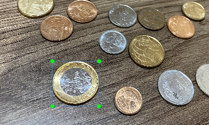
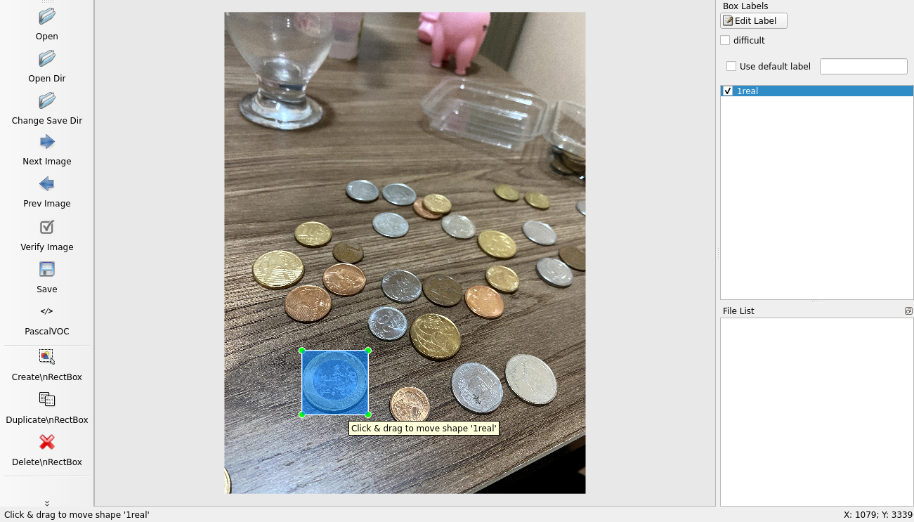
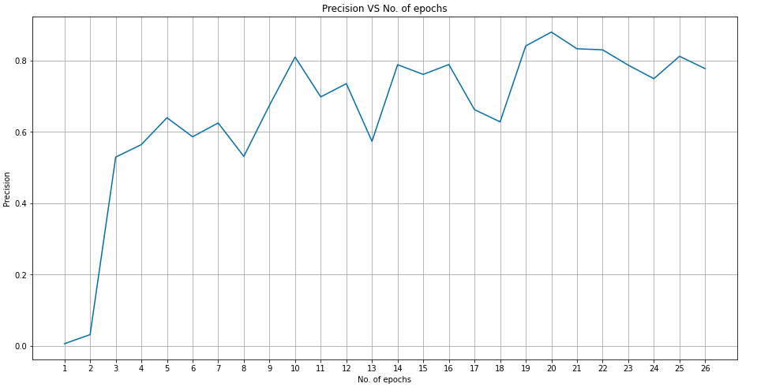

# Computer Vision zero to hero: A tutorial about coin recognition

Computer vision is interesting, huh? Have you seen the demos of Pulse [1] or NVIDIA Maxine [2]?  
However, it's common when there are no pre-trained models for your task, no benchmark datasets, no easy to follow tutorials, and you don't have a whole team to develop wonderful machine learning models. 

How to achieve, in a very short time and with little prior knowledge, acceptable results that may serve as proof of concept? In this tutorial you'll learn this process end to end, following a practical example about coin recognition  

## Reducing the scope
Our objective is simple: to identify Brazilian coins. 
Well... it's not that simple: there are 4 different types of coin, that can be rusted or in bad condition, that may be partially occluded in the photo, the scenes can vary greatly in illumination, among other challenges.
So we decided to reduce the scope of the project to the bare minimum, the simplest feature that could demonstrate that the idea could work: to identify one type of coin (the one of 1 Brazilian real, as shown in Figure 1), under normal indoor lighting, in clear and "easy" photographs.


## Choosing the technologies
What will we use? Which languages, frameworks, development environments? 
We are looking for technologies easy to understand, with acceptable results, with good documentation and tutorials. You may change it in the future when faced with constraints like computational performance or easiness to deploy, but now the focus is just to prove that your project can be done. We don't need to reinvent the wheel. 
Among several options, the framework ImageAI [3] fits well our needs: it is easy to learn, very little boilerplate, very good documentation and spectacular results. Comparing to other libs, ImageAI was the easiest to learn and with the best results.  
To label de dataset, we chose the library labelImg [4] because it is an open-source solution with an easy learning curve and had all the functionalities needed.  

## Labeling a dataset
You already defined your scope, now: what type of data you need to represent the information you need?  
In our case will be enough to have photos of several coins on the table and on our hand, taken with a cellphone camera (today's cellphone have nice cameras to do tasks like this), with bounding boxes around the one of 1 real (1BRL). 



We decided to annotate 250 images, but it was just a guess: you may need more, you may need less, you may have to label more data after trying to train the model and not achieving good enough results, it depends.  
We'll use this data to train our model, but how we'll know how well it will be when faced with new data, in a real situation?  
We may want to label more data in the future and compare the model's predictions with our own labels. It's a good idea, but why not label this "test dataset" just now? Even better, why not just hold out part of the already labeled dataset, excluding it from training and using it only for testing?  
Word of advice: The labeling process is very long and trust me, this needs to be done right. So take your time, put some music on and do this with attention.  



## Training a model
You don't want, now, to spend much time training or to pay a small fortune in cloud computing. Furthermore, you don't want to perform a careful fine-tuning in the model, you just need an acceptable precision (that, for most problems, is much lower than the state of the art). After the environment setup, the code itself is just 6 lines (declare the neural network architecture to be used, point to the data, set hyperparameters, start training):

```
from imageai.Detection.Custom import DetectionModelTrainer

trainer = DetectionModelTrainer()
trainer.setModelTypeAsYOLOv3()
trainer.setDataDirectory(data_directory="hololens")
trainer.setTrainConfig(object_names_array=["hololens"], batch_size=4, num_experiments=100, train_from_pretrained_model="pretrained-yolov3.h5")
trainer.trainModel()
```

We'll use a famous architecture, YoloV3, pretrained on a famous dataset, ImageNet. This will speed up the training and make it easier to get good results, that is exactly what we want. Comparing with this [example](https://imageai.readthedocs.io/en/latest/customdetection/) of the ImageAI library, they've used 400 epochs in a dataset of 300 images, taking 300s per epoch. In our case, we used 30 epochs with 3000s each. WHY? Because our images were HUGE, and the higher the resolution the higher will be the training time. Lesson learned: use images as clear as you can get and with a resolution that captures all the details you need, but NOT MORE than that.  
Notice: The relation 1epoch/3000s is based on my computer. Assuming that the example on the ImageAI docs was made on a home computer also, the previous assertion is true. If not, my advice is still the same: images big enough only to capture the details you need. The time consumed per epoch will be lower, but not in the same proportion as the one I compared before.  
  
Well... And how many epochs did I need?  
Since the ImageAI lib itself will change the machine learning params, the more the better. A good number, to start, is 25. Then you will need to run an evaluation script, which will use the test images to verify the precision of our model.

Doing that, with 25 epochs, the precision obtained in the process was:  
  


Which we can see that started very poorly but improved until the peak value of 0.87 on the 20th epoch.

## Reporting and communicating
For proof of concept, we have already achieved a lot. Our model doesn't need human-level precision to be useful: if it can save time or help someone to do its job, it already worth the effort
So it's DONE!!
Not yet.
If you want to keep working on the model (and there is still a lot of room for improvements), you'll probably have to *convince* others that your time worth the effort. Particularly to coin recognition, machine learning probably is the best approach to follow, but for most real problems the decision is much less clear, so you have to carefully analyze your results and the methodology that led to them in order to decide how to continue.
Here are some post-development tips:
* Clearly identify the procedures done to get your results (something like what we are doing here);
* Explain your evaluation metrics, and what they mean in a practical context;
* Understand what you've done, in case you didn't before. This is not an extensive tutorial in theoretical background, but we highly recommend you to go deeper and understand what was done;
* Show that this was just an initial result and point out some directions for future works.
* Organize all this in a slide presentation, online dashboard, some easy-to-read document, repo's readme, anything like that.

# References
[1] - S. Menon, A. Damian, M. Hu, N. Ravi, and C. Rudin (2020). PULSE: Self-Supervised Photo Upsampling via Latent Space Exploration of Generative Models. The IEEE Conference on Computer Vision and Pattern Recognition (CVPR). http://pulse.cs.duke.edu/

[2] - NVIDIA (2020). The NVIDIA Maxine. https://blogs.nvidia.com/blog/2020/10/05/gan-video-conferencing-maxine/

[3] - Moses and J. Olafenwa (2018). ImageAI, an open source python library built to empower developers to build applications and systems with self-contained Computer Vision capabilities. https://github.com/OlafenwaMoses/ImageAI.

[4] - Tzutalin (2015). LabelImg. Git code. https://github.com/tzutalin/labelImg
